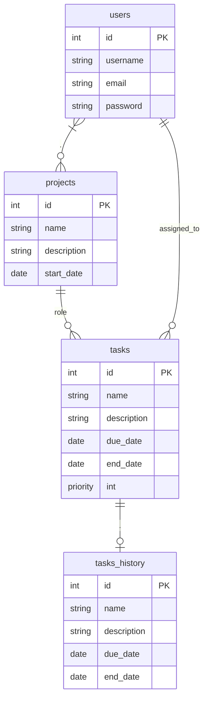

# Project management tool

Github repository : [https://github.com/FloRobart/pmt](https://github.com/FloRobart/pmt)

## Table des matières

- [Project management tool](#project-management-tool)
    - [Table des matières](#table-des-matières)
    - [Description](#description)
    - [MCD et MLD](#mcd-et-mld)
        - [MCD (Modèle Conceptuel de Données)](#mcd-modèle-conceptuel-de-données)
        - [MLD (Modèle Logique de Données)](#mld-modèle-logique-de-données)
    - [Launching the application](#launching-the-application)
        - [In production](#in-production)
        - [For the developpement](#for-the-developpement)
    - [Stop the application](#stop-the-application)

## Description

**PMT** est une plateforme de gestion de projet collaboratif destinée aux équipes de
développement logiciel.

## MCD et MLD

### MCD (Modèle Conceptuel de Données)



### MLD (Modèle Logique de Données)

users (id, username, email, password)
projects (id, name, description, start_date)
tasks (id, name, description, due_date, end_date, priority, id_project, assigned_to)
tasks_history (id, name, description, due_date, end_date, id_task)
r_users_projects (id_user, id_project, role)

## Launching the application

### In production

- In empty repository
- Copy file `.env.example` from Github in file `.env` on your local machine.
- Copy file `docker-compose.yml` from Github in file `docker-compose.yml` on your local machine.
- Copy file `run.sh` from Github in file `run.sh` on your local machine.
- Make the script executable.

    ```sh
    chmod +x run.sh
    ```

- execute `run.sh` to pull the production image and launch the application.

### For the developpement

- Clone repository

    ```sh
    git clone https://github.com/FloRobart/pmt.git
    ```

- Copy file `.env.example` in file `.env`.

    ```sh
    cp .env.example .env
    ```

- execute docker compose command to build and launch the application.

    ```sh
    docker compose -f docker-compose.prod.test.yml up -d --force-recreate --build
    ```

## Stop the application

- execute `stop.sh` to stop the application and remove the Docker container.

    ```sh
    ./stop.sh
    ```
